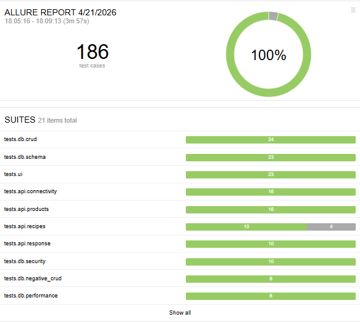
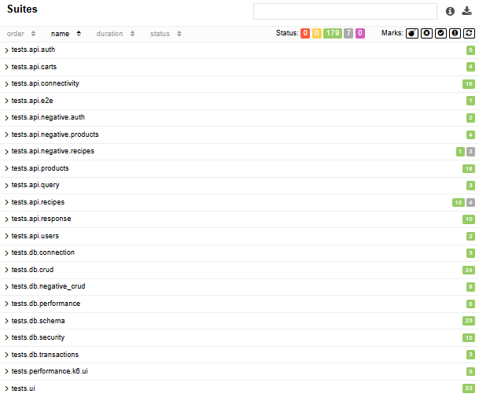
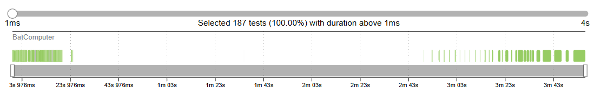
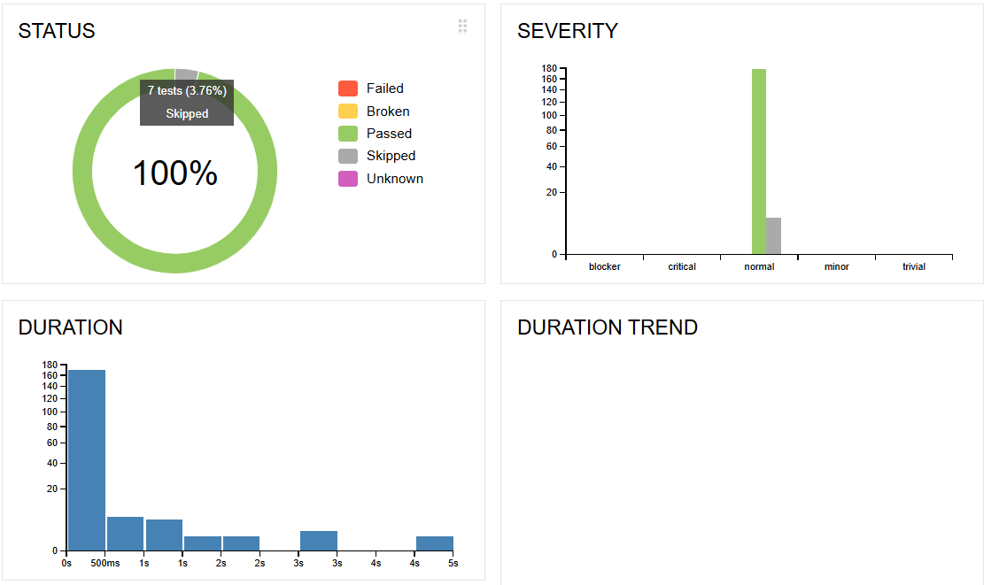
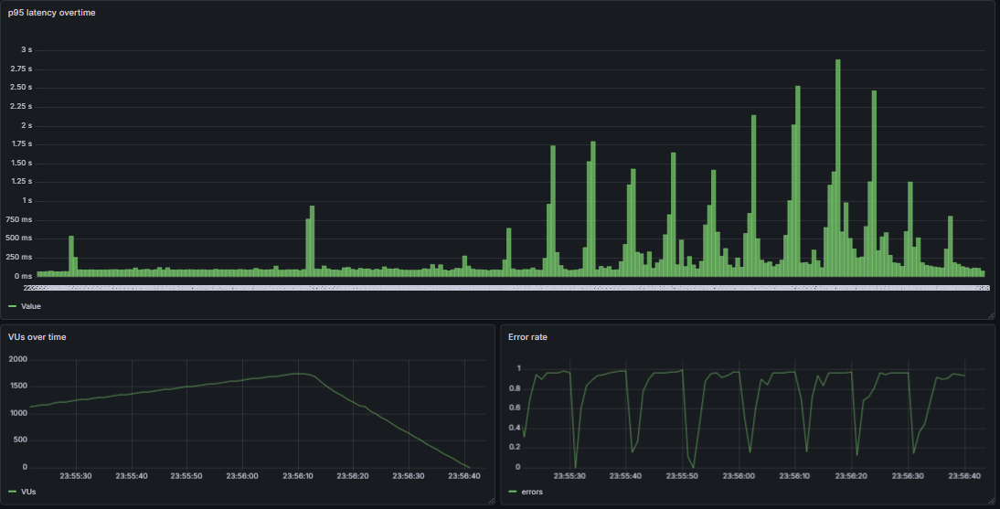
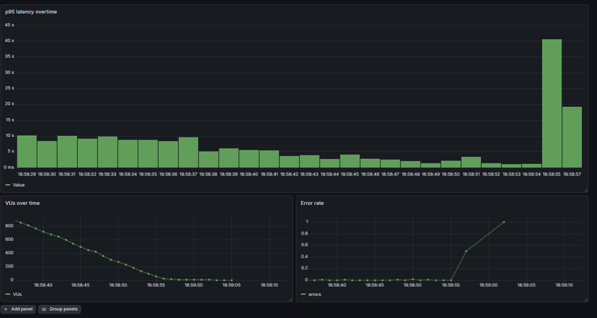

# 🔐 Secure QA Automation Platform

A comprehensive QA automation project combining **API, UI, Database, Performance, and Security testing** into a single, structured workflow.

---

## 🚀 Overview

This project demonstrates a **real-world QA approach**, going beyond basic testing by integrating:

* Functional testing (API, UI, DB)
* Performance testing (k6)
* Security testing (OWASP Top 10)
* Reporting (Allure)

The goal is to simulate how a QA engineer works in a **production-like environment**, not just writing isolated tests.

---

## 🧩 Project Scope

This platform covers multiple testing layers:

* ✅ API Testing (pytest)
* ✅ Database Testing (PostgreSQL / Pagila)
* ✅ UI Testing
* ✅ Performance Testing (k6)
* ✅ Security Testing (OWASP Juice Shop)
* ✅ Test Reporting (Allure)

---

## 🧱 Architecture

project/
├── src/ # Core logic, helpers, and reusable components
├── tests/
│ ├── api/
│ ├── db/
│ ├── ui/
│ ├── performance/
│ ├── security/

The project follows a layered structure:

- **src/** → contains reusable classes, utilities, and abstractions used across tests  
- **tests/** → contains test suites organized by domain (API, DB, UI, Performance, Security)

This separation ensures:

- better code reuse  
- cleaner test logic  
- easier scalability and maintenance  

## 🧪 Test Coverage

* 🔹 180+ automated tests
* 🔹 Structured test suites (API, DB, UI, Performance, Security)
* 🔹 Positive and negative scenarios
* 🔹 Real-world workflows (E2E)

---

## ⚡ Performance Testing (k6)

Implemented multiple realistic scenarios:

* Read all products
* Read single product
* Filter products
* Add product
* Authenticated user workflow (login → user info → product access)
* UI end-to-end "happy path" (full journey timing)

### 📊 Key Focus

* Response time (avg, p95)
* Error rates
* Iteration-based UI performance tracking

---

## 🔐 Security Testing

Security testing was performed against **OWASP Juice Shop**, combining:

* Automated scanning (OWASP ZAP)
* Manual validation
* Exploitation of real vulnerabilities

### 🔥 Identified Vulnerabilities

* 🔴 Authentication Bypass via Injection (Critical)
* 🔴 Broken Access Control (IDOR)
* 🟠 Reflected XSS
* 🟡 Security Misconfigurations

---

## 📊 Reporting (Allure)

All tests are integrated with **Allure Reports** for clear visualization.

### 🧾 Highlights

* Test execution overview
* Suite-level organization
* Duration distribution
* Timeline analysis

---

## 📸 Screenshots

### 🔹 Allure Overview

---

### 🔹 Test Suites Structure

---

### 🔹 Execution Timeline

---

### 🔹 Duration Distribution

----------------------------------------------------------------------------------------------------
### 🔹 Stress Test – Progressive Load Increase with Latency Degradation

---

### 🔹 Stress Test – System Failure Point and Performance Breakdown

---

## 🧠 Key Takeaways

* Automated tools alone are not enough — **manual validation is critical**
* Performance must be measured at both **API and user workflow levels**
* Security testing requires **understanding logic, not just running scans**
* A well-structured test suite is as important as the tests themselves

---

## 🛠️ Tech Stack

* Python (pytest)
* k6 (performance testing)
* OWASP ZAP (security testing)
* Docker
* PostgreSQL (Pagila DB)
* Allure Reports

---

## 📌 Why This Project Matters

This project demonstrates the ability to:

* Design a **multi-layer QA strategy**
* Combine **functional, performance, and security testing**
* Work with **real tools used in industry**
* Produce **structured and meaningful reports**

---

## 📎 Future Improvements

* CI/CD integration (GitHub Actions)
* Allure trend history
* Extended security coverage
* Advanced performance scenarios

---

## 👤 Author

**BAZOURHI Mohamed Saad**
QA Automation Engineer

---
