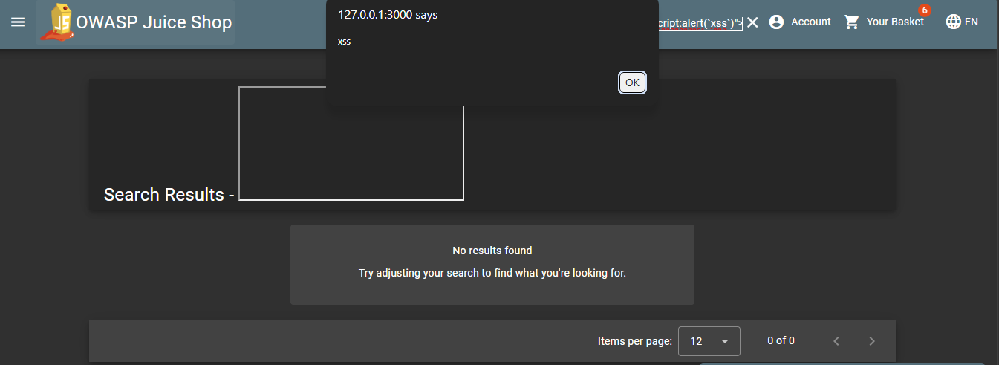
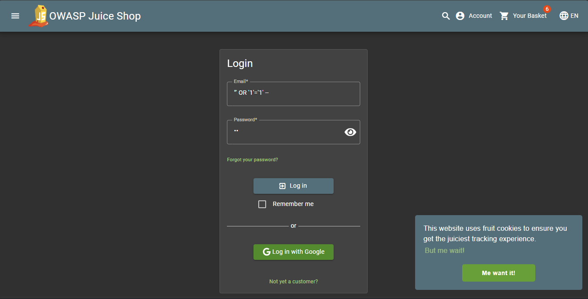
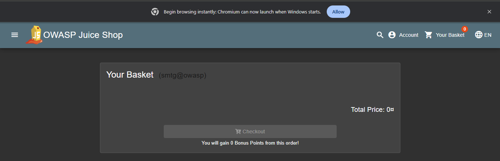
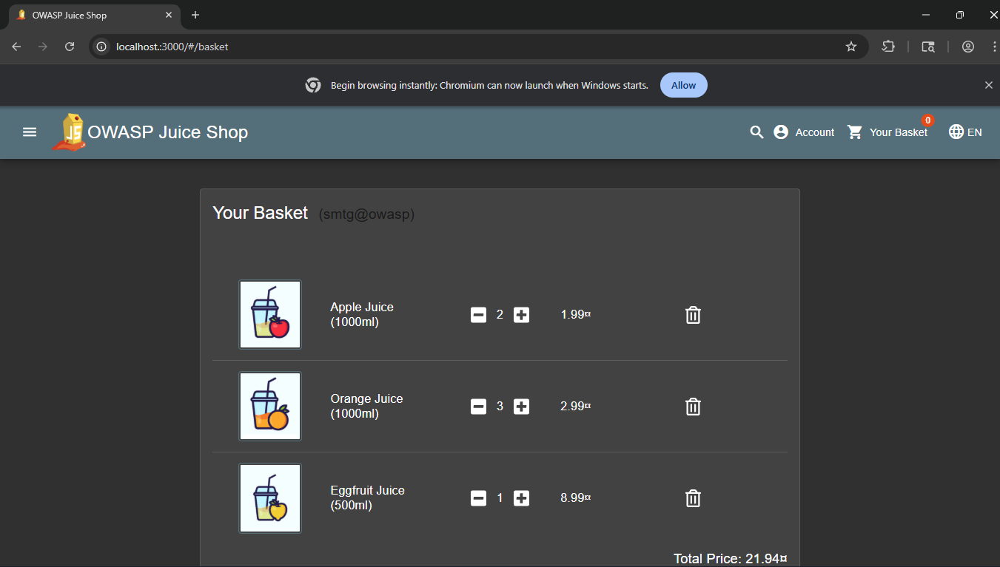

### 🔴 1. Authentication Bypass via Injection

**Observation**  =>     The login functionality is vulnerable to an injection-based authentication bypass. By manipulating the username input with a crafted payload, it is possible to bypass credential validation entirely.

**Proof of Concept**  
Payload used:   =>  "' OR '1'='1'--

=> The application grants access without verifying the provided credentials, resulting in successful login as an administrative user.

**Impact**  
This vulnerability leads to a complete compromise of authentication mechanisms. An attacker can gain unauthorized access to privileged accounts and sensitive data, including:
        - User email addresses  
        - Phone numbers  
        - Partial payment information  
        - Account management features (password change, data export, account deletion)

**Severity**  
🚨 Critical 🚨

**Recommendation**  
Use parameterized queries or prepared statements, enforce strict input validation, and avoid constructing queries dynamically from user input.

❌ Instead of : 
SELECT * FROM users WHERE email = '$email' AND password = '$password';

✅Use : 
SELECT * FROM users WHERE email = ? AND password = ?;

### 🔴 2. Broken Access Control (IDOR)

**Observation**  =>     The application does not properly enforce access control on basket resources. By modifying the basket identifier in API requests, it is possible to access data belonging to other users.

**Proof of Concept**  
Original request:
GET /rest/basket/6

Modified request:
GET /rest/basket/4

The server responds with another user’s basket data without verifying ownership.

**Impact**  =>      This allows unauthorized access to user-specific data and may lead to further manipulation of other users’ baskets or transactions.

**Severity**  
🛑 High 🛑

**Recommendation**  =>      Implement strict server-side authorization checks and ensure that each request is validated against the authenticated user’s permissions.

---

### 🟠 3. Reflected Cross-Site Scripting (XSS)

**Observation**  =>     The search functionality is vulnerable to reflected XSS. While basic sanitization is in place and blocks simple payloads, it can be bypassed using alternative input.

**Proof of Concept**  

Blocked payload:

Successful payload:
<iframe src="javascript:alert(`xss`)">

The payload is executed in the browser, confirming that user input is not properly sanitized.

**Impact**  
An attacker can execute arbitrary JavaScript in the context of the victim’s browser, potentially leading to session hijacking, data theft, or phishing attacks.

**Severity**  
⚠️ Medium ⚠️

**Recommendation**  =>  Apply proper output encoding, strengthen input sanitization, and implement a robust Content Security Policy (CSP).

---

### 🟡 4. Security Misconfiguration

#### Missing Content Security Policy (CSP)

**Observation**  
The application does not implement a Content Security Policy header across multiple endpoints.

**Impact**  
This increases exposure to client-side attacks by allowing unrestricted script execution.

**Recommendation**  
Define and enforce a strict CSP.

---

#### Cross-Domain Misconfiguration

**Observation**  =>     Cross-origin requests are not properly restricted.

**Impact**  =>      This may allow unintended interaction from external domains.

**Recommendation**  =>      Restrict allowed origins to trusted domains only.

---

#### Information Disclosure (Timestamp Exposure)

**Observation**  =>     Unix timestamps are exposed in responses.

**Impact**  =>      This provides minor contextual information that could assist an attacker.

**Recommendation**    =>        Avoid exposing unnecessary metadata.